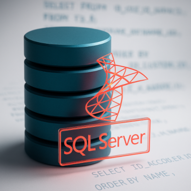

# **About**
[About SQL](https://github.com/MiKL5/DS/tree/master/SQL)  
[SQL vs T-SQL vs PL/SQL](docs/compare)  
[Procedural SQL](plsql)  
[Transact-SQL](tsql)  
[Langage déclaratif versus procédural](declarative2procedural)

[Version](version)

[Stored procedure](storedProcedure)  
[Sargability](sargability)  

  